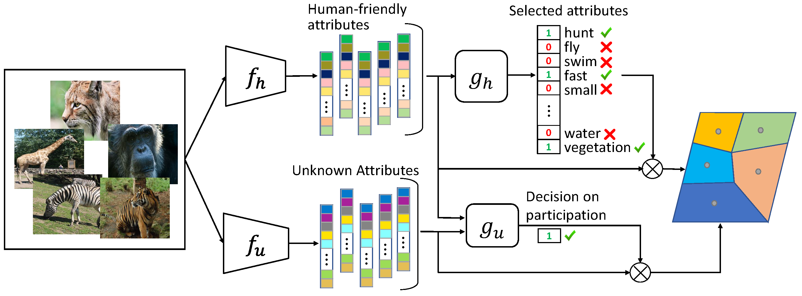

# Interpretable Few-Shot Learning with Online Attribute Selection

This is the official implementation of **“Interpretable Few-Shot Learning with Online Attribute Selection”**, published in *Neurocomputing* 614 (2025) 128755.

[](https://doi.org/10.1016/j.neucom.2024.128755)  
[](https://www.python.org/)  
[](https://pytorch.org/)  
[](LICENSE)


## Overview


Few-shot learning (FSL) seeks to generalize to new classes from only a handful of examples, yet most FSL methods remain opaque, limiting user trust and interpretability. This repository provides the official implementation of an inherently interpretable FSL framework that:

1. **Predicts human-friendly attributes** from images, serving as a semantically meaningful embedding space.  
2. **Selects relevant attributes online** via a lightweight Gumbel-Softmax mechanism, filtering out noise and improving both accuracy and clarity.  
3. **Detects insufficiency of known attributes** in each episode and dynamically augments the pool with learned “unknown” attributes when needed.  

Our method achieves results on par with black-box FSL models on four standard benchmarks (CUB, AWA, SUN, aPY) while delivering clear, attribute-based explanations that align more closely with human reasoning.

<p align="center">
  
  <br>
  <em> High-level pipeline of few-shot classification using IFSL. Top: The process of predicting and selecting relevant human-friendly attributes for the current episode. Bottom: The process of predicting unknown attributes and deciding whether the unknown attributes should participate in the current episode or not.</em>
</p>

---

## Installation

1. **Clone the repository**  
   ```bash
   git clone https://github.com/mrzarei5/IFSL.git
   cd IFSL
   ```

2. **Create & activate Conda environment**  
   ```bash
   conda create -n IFSL python=3.8
   conda activate IFSL
   ```

3. **Install dependencies**
    ```bash
    pip install -r requirements.txt
    # For GPU support (adjust CUDA version as needed):
    pip install torch torchvision torchaudio --index-url https://download.pytorch.org/whl/cu118
    ```

## Data Preparation

Place your datasets under the `datasets/` folder with this structure:

```text
IFSL/
├── datasets/
│   ├── CUB/
│   ├── AWA/
│   ├── SUN/
│   └── aPY/
├── ...
```

Generate filelists for each dataset:

```bash
python data_scripts/write_CUB_filelist.py # Repeat/adapt for AWA, SUN, aPY
```

## Usage

1. **Train the Attribute Predictor**
    ```bash
    python att_predictor.py \
    --dataset CUB \
    --dataset_dir ./datasets/CUB \
    --n_support 1 --n_query 16 \
    --lr_backbone_network 1e-3
    ```

2. **Train the Attribute Selector**
    ```bash
    python att_selector.py \
    --dataset CUB \
    --dataset_dir ./datasets/CUB \
    --alpha 1.0 --gamma 0.0
    ```

3. **Learn Unknown Attributes**
    ```bash
    python att_learning_unknown.py \
    --dataset CUB \
    --dataset_dir ./datasets/CUB \
    --n_support 1 \
    --n_mi_learner 10 \
    --decoupling_weight 2.0
    ```

4. **Train Unknown Participation Detector**
    ```bash
    python unknown_participation_detector.py \
    --dataset CUB \
    --dataset_dir ./datasets/CUB \
    --alpha 1.0 --gamma 0.0 --beta 0.7 \
    --n_support 1 --n_query 16
    ```

##Citation
Please cite our work if you use this code or dataset:

If you use this work, please cite:

```bibtex
@article{Zarei2025IFSL,
    title   = {Interpretable Few‐Shot Learning with Online Attribute Selection},
    author = {Mohammad Reza Zarei and Majid Komeili},
    journal = {Neurocomputing},
    volume = {614},
    pages = {128755},
    year = {2025},
    issn = {0925-2312},
    doi = {https://doi.org/10.1016/j.neucom.2024.128755},
    url = {https://www.sciencedirect.com/science/article/pii/S0925231224015261}
}